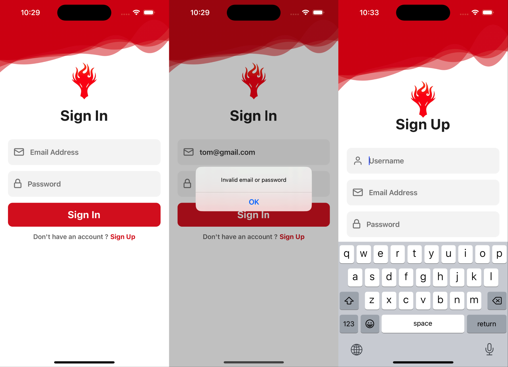
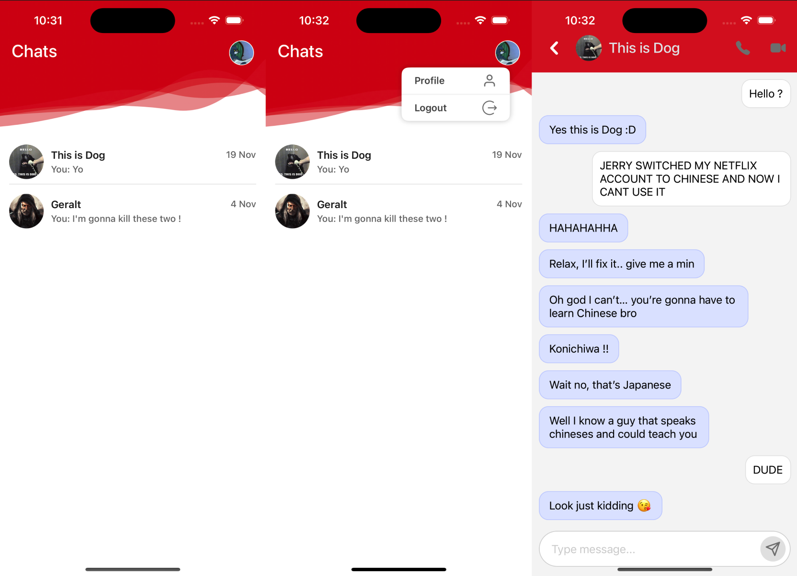

  

  

Chat app that uses <a href="https://firebase.google.com/codelabs/firebase-android#0">Firebase </a> to handle messaging, with a very simple authentication process for Sign in and Sign up.

## Run App

    npm install
    npm run start

    # Press I to open iOS simulator
    # Press A to open Android emulator

## Decisions

- Use Expo for easier configurations, installing libraries with the correct versions, better debugging, easier building apk and ipa process, easier use of emulators/simulators, and many other benefits.
- use hooks and a Context to handle auth state.
- use Typescript, and linter + prettier configurations to improve the code quality, readeability and to avoid typing bugs.

## Credits

- This app is based on Nomi's<a href='https://www.youtube.com/watch?v=INxkJno2gIs&list=PLKWMD009Q4qRvrfjGotVfUbqGoLdvRDN4&index=2'> Build a React Native App with Firebase Auth & Chat</a> tutorial 
- <a href='https://expo.dev/'>Expo</a>
- <a href='https://docs.expo.dev/router/installation/'>Expo Router</a>
- <a href='https://www.nativewind.dev/'>NativeWind</a>
- <a href='https://docs.swmansion.com/react-native-reanimated/'>React Native Reanimated</a>
- <a href='https://www.typescriptlang.org/'>Typescript</a>

## Improvement areas

- Unit and E2E testing to be able to test the app without the UI. Using jest and Detox.
- add a profile screen
- maybe improve speed when fetching data
- show some image or text message if there are no users in the Chat List Screen
- add scrollview in case if there are many users
